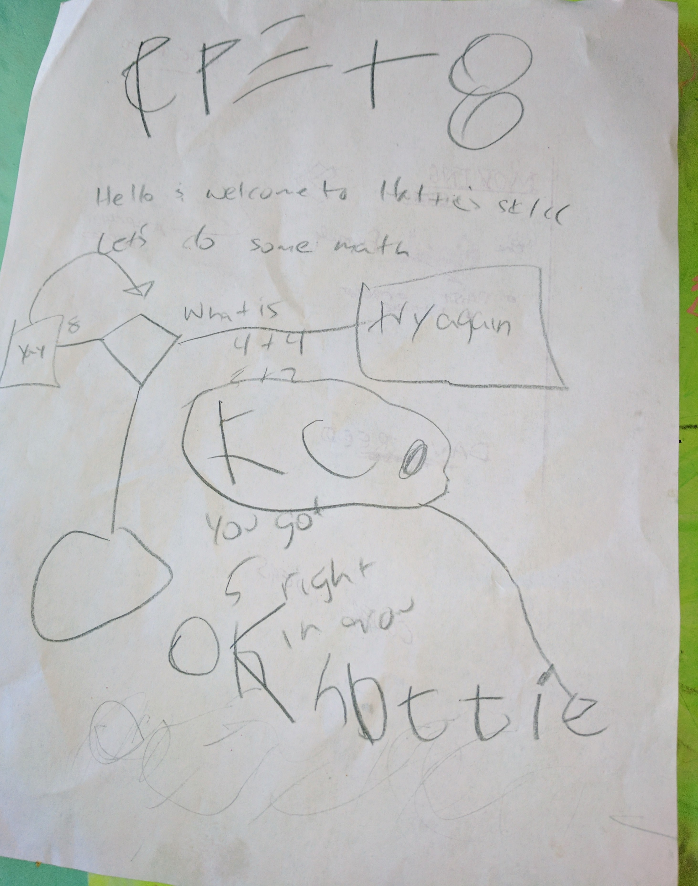

# Kitty Math

My daughter wanted an Alexa Dot for her bedroom.

I told her to come up with an idea and we'd submit it for the [free socks and Amazon Dot contest](https://developer.amazon.com/alexa-skills-kit/alexa-developer-skill-promotion).

This is the flowchart she came up with

It adapts along with you so eventually you'll stop using finger counting...I hope.